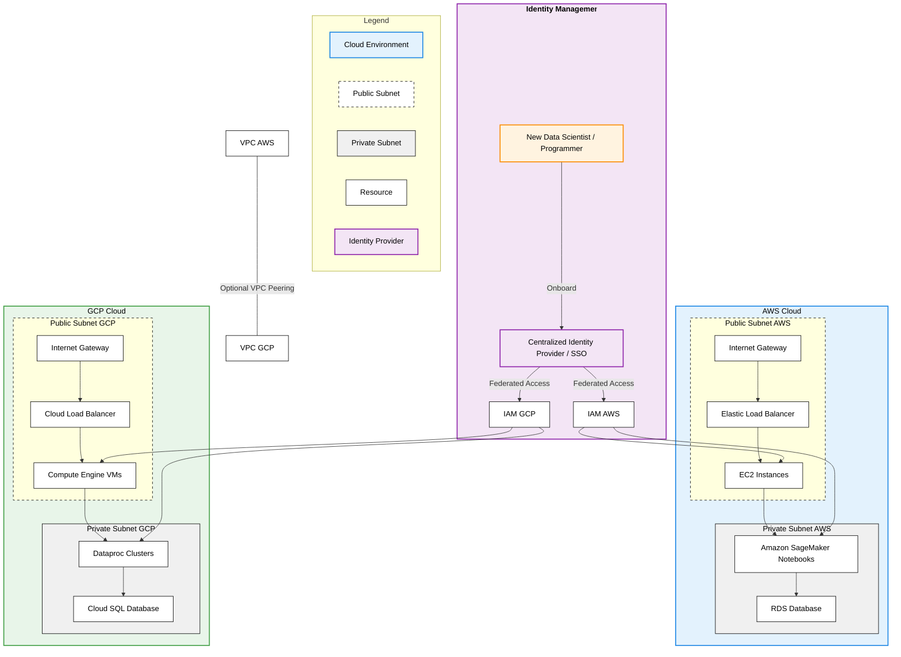

# vpc_setup

**Explanation of the Architecture:**

1. **VPC Structure for AWS and GCP:**
    - **AWS Cloud:**
        - **VPC_AWS** contains both public and private subnets.
        - **Public Subnet:** Hosts the **Internet Gateway**, **Elastic Load Balancer (ELB)**, and **EC2 Instances**.
        - **Private Subnet:** Contains **Amazon SageMaker Notebooks** and **RDS Databases**.
        - **EC2 Instances** in the public subnet can access resources in the private subnet.

    - **GCP Cloud:**
        - **VPC_GCP** also consists of public and private subnets.
        - **Public Subnet:** Includes the **Internet Gateway**, **Cloud Load Balancer**, and **Compute Engine VMs**.
        - **Private Subnet:** Houses **Dataproc Clusters** and **Cloud SQL Databases**.
        - **Compute Engine VMs** can access private resources like Dataproc clusters and Cloud SQL databases.

2. **Resource Deployment:**
    - All resources (notebooks, Dataproc clusters, VMs, databases) are deployed within their respective VPCs.
    - Resources are segmented into public and private subnets for security and scalability.
    - Load balancers in the public subnets manage incoming traffic and distribute it to the appropriate resources.

3. **Identity and Access Management (IAM):**
    - **Centralized Identity Provider (IdP)/SSO:** Acts as a single source of truth for user identities.
    - **New Users** are onboarded automatically through the IdP, which could be a system like **Okta**, **Azure AD**, or
      any SAML/OIDC-compliant provider.
    - The IdP federates access to both **IAM_AWS** and **IAM_GCP**, streamlining authentication and authorization
      processes.
    - **IAM Roles & Policies** in both AWS and GCP are configured to trust the IdP, allowing for seamless user
      provisioning and access control.

4. **Automated Onboarding and Authentication:**
    - New data scientists and programmers are added to the IdP, which automatically provisions their access to resources
      in AWS and GCP.
    - Role-based access control (RBAC) ensures users have the necessary permissions without manual intervention.
    - Policies are centrally managed, reducing the risk of misconfigurations and enhancing security compliance.

5. **Optional VPC Peering:**
    - **VPC Peering** between AWS and GCP VPCs enables direct network traffic between resources in both clouds.
    - This setup is optional and can be configured based on specific cross-cloud communication requirements.

6. **Security and Best Practices:**
    - Separation of public and private subnets enhances security by isolating resources that do not require direct
      internet access.
    - Use of IAM roles and policies enforces the principle of least privilege.
    - Centralized identity management reduces administrative overhead and improves compliance with security standards.

**Expert Considerations:**

- **Scalability:** The architecture supports horizontal scaling by adding more instances or resources within the
  subnets.
- **High Availability:** Deploying resources across multiple availability zones (not depicted) can further enhance
  resilience.
- **Cost Efficiency:** Utilizing reserved instances and optimizing resource utilization can reduce operational costs.
- **Compliance:** Adhering to industry standards like **ISO 27001**, **HIPAA**, or **GDPR** is facilitated through
  centralized policies.

**Implementation Notes:**

- **Infrastructure as Code (IaC):** Use tools like **Terraform** or **CloudFormation** to codify and automate the
  deployment of this architecture.
- **Continuous Integration/Continuous Deployment (CI/CD):** Implement pipelines to automate the deployment and updates
  of resources.
- **Monitoring and Logging:** Integrate with services like **AWS CloudWatch**, **GCP Cloud Monitoring**, or third-party
  solutions for observability.

