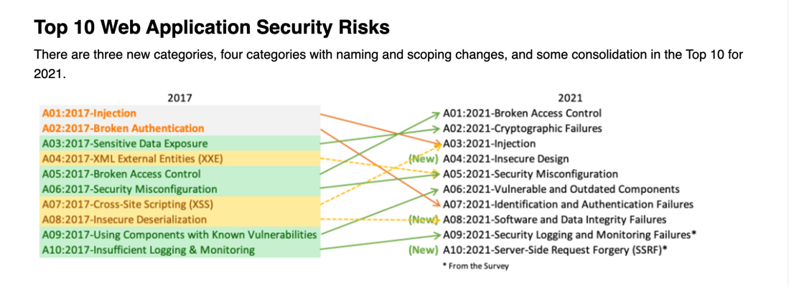

# Contact SOC of your company

A security operations center (SOC)
Common Vulnerabilities and Exposures

# Threat Model erstellen

# CVSS

Klassifizierung von Schwachstellen

## Folgewirkung

## Metrices

https://nvd.nist.gov/vuln-metrics/cvss/v4-calculator?name=CVE-2024-4976

## OWASP Top 10

https://owasp.org/www-project-top-ten/

# Which Hacker-Groups Stories?

https://attack.mitre.org/

https://attack.mitre.org/groups/

https://haveibeenpwned.com/

https://haveibeenpwned.com/API/v3

https://haveibeenpwned.com/API/v3

# Further reads

https://darknetdiaries.com/episode/

# Try yourself

https://juice-shop.herokuapp.com/#/login

# Play

https://www.blackhillsinfosec.com/projects/backdoorsandbreaches/

# Search yourself

https://crt.sh/

https://www.shodan.io/

https://app.netlas.io/registration/

https://search.censys.io/
