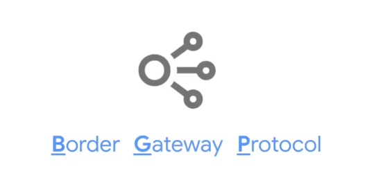
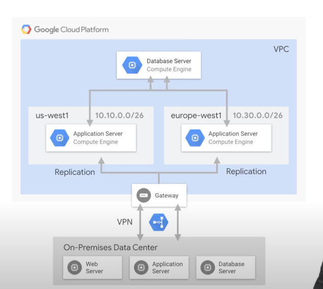

https://www.youtube.com/watch?v=cNb7xKyya5c

# Use Cases

Google Cloud VPC is ideal for situations
3:55
where you're hosting globally distributed
3:57
multi-tier applications by creating a VPC with subnets,
4:02
or connecting GCP-hosted or externally hosted databases
4:06
to Google's unique machine learning services
4:08
by creating a VPC with subnets and VPN access,
4:12
or even disaster recovery with application replication,
4:15
create backup GCP compute capacity,
4:18
then revert back to it once the incident is over.