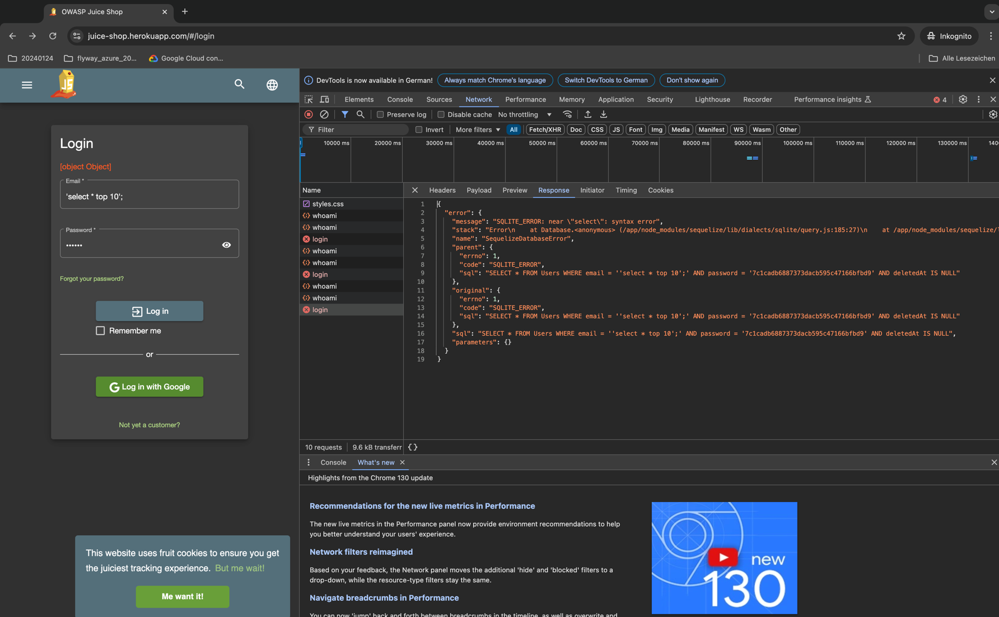

# Create a thread model for each solution

## static code anlysis

## snyk

## renovate 

# Governance 

# Risk 

# Compliance 

# Notfallmanagement 

# Recovery 

# Cinitunity 

trufflehawk

https://github.com/trufflesecurity/trufflehog

https://ddosecrets.com/